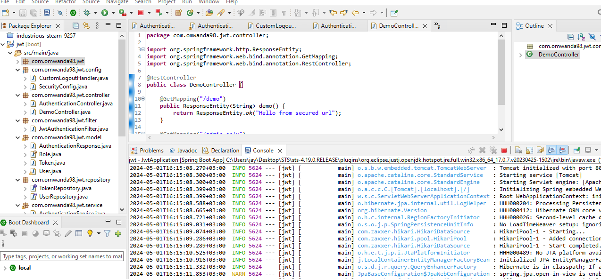
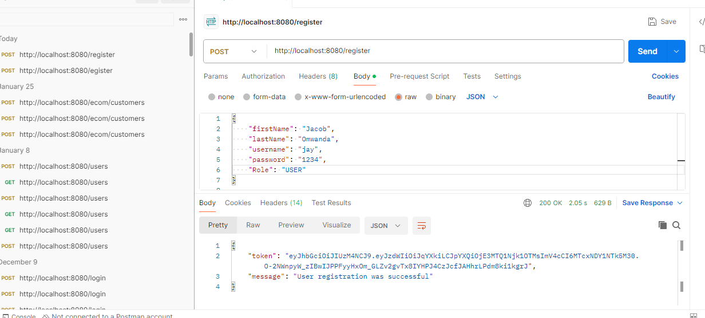
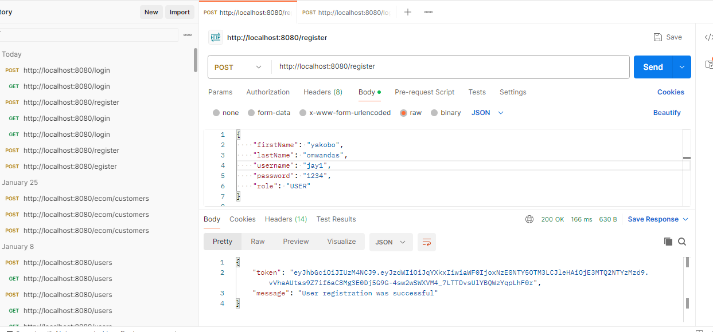
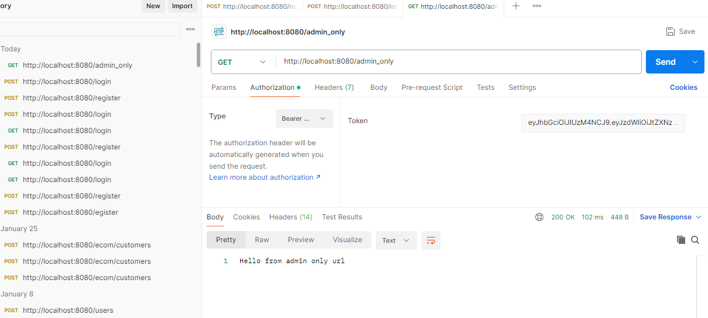

# Spring Security based JWT Authentication

This project implements JWT authentication with Spring Security. It includes endpoints for admin and user roles.

## Screenshots

### Testing

### Registration

### Login

### Admin-Only Access

